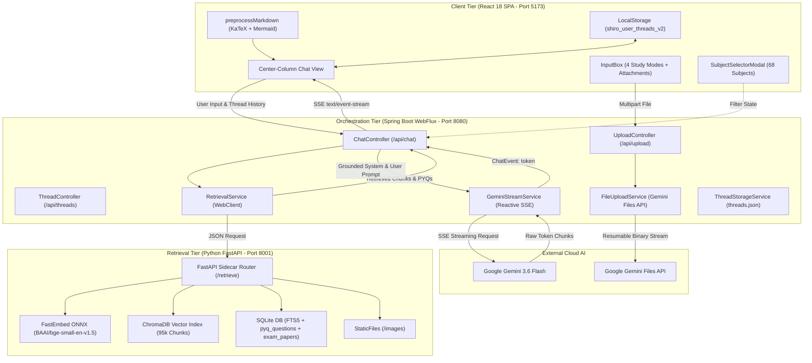

# 🎓 ChiroShiro (Shiro) — University Coursework & Academic Syllabus RAG System

[](LICENSE)
[](https://spring.io/projects/spring-boot)
[](https://projectreactor.io/)
[](https://fastapi.tiangolo.com)
[-blueviolet.svg)](https://github.com/qdrant/fastembed)
[](https://www.trychroma.com)
[](https://www.sqlite.org/fts5.html)
[-61DAFB.svg)](https://react.dev)
[](https://ai.google.dev)
[](https://www.docker.com)
[](https://vercel.com)
[](https://render.com)

Built by [**rishiicreates**](https://rishiicreates.vercel.app/)

---

## 📖 Table of Contents

- [Executive Summary](#-executive-summary)
- [System Architecture](#-system-architecture)
  - [High-Level Architecture Diagram](#high-level-architecture-diagram)
  - [Three-Tier Design Breakdown](#three-tier-design-breakdown)
  - [End-to-End Request-Response Lifecycle](#end-to-end-request-response-lifecycle)
- [Core Features & Pedagogical Engine](#-core-features--pedagogical-engine)
  - [1. Four Interactive Study Modes](#1-four-interactive-study-modes)
  - [2. Tri-Modal Hybrid Retrieval Engine](#2-tri-modal-hybrid-retrieval-engine)
  - [3. Multi-Turn Context Continuity & Query Enrichment](#3-multi-turn-context-continuity--query-enrichment)
  - [4. Distinct Personality & Adaptive Prompting](#4-distinct-personality--adaptive-prompting)
  - [5. Mathematical & Visual Rendering (KaTeX + Mermaid)](#5-mathematical--visual-rendering-katex--mermaid)
  - [6. Multimodal File Attachments (Gemini Files API)](#6-multimodal-file-attachments-gemini-files-api)
  - [7. Private Continuous Student Session Memory](#7-private-continuous-student-session-memory)
- [Repository Structure](#-repository-structure)
- [Component Breakdown](#-component-breakdown)
  - [Python Retrieval Sidecar (`:8001`)](#1-python-retrieval-sidecar-8001)
  - [Spring Boot Reactive Backend (`:8080`)](#2-spring-boot-reactive-backend-8080)
  - [React + Vite Frontend (`:5173`)](#3-react--vite-frontend-5173)
- [Data Assets & Vector Indexing Pipeline](#-data-assets--vector-indexing-pipeline)
  - [Corpus Taxonomy & Manifest](#corpus-taxonomy--manifest)
  - [Relational Database Schema (`the_helper_rag.db`)](#relational-database-schema-the_helper_ragdb)
  - [Split Archive Storage & Auto-Reassembly](#split-archive-storage--auto-reassembly)
  - [Slide & Diagram Figure Extraction](#slide--diagram-figure-extraction)
- [API & Interface Reference](#-api--interface-reference)
  - [Backend Endpoints (`:8080`)](#backend-endpoints-8080)
  - [Sidecar Endpoints (`:8001`)](#sidecar-endpoints-8001)
- [Environment Configuration](#-environment-configuration)
- [Getting Started & Local Development](#-getting-started--local-development)
  - [Prerequisites](#prerequisites)
  - [Option A: Quickstart via Unified Launcher](#option-a-quickstart-via-unified-launcher-recommended)
  - [Option B: Manual Step-by-Step Launch](#option-b-manual-step-by-step-launch)
- [Docker & Containerized Deployment](#-docker--containerized-deployment)
  - [Multi-Stage Dockerfile](#multi-stage-dockerfile)
  - [Building and Running the Container](#building-and-running-the-container)
  - [Cloud Deployment (Render / Railway / Vercel)](#cloud-deployment-render--railway--vercel)
- [Evaluation & Grounding Benchmark](#-evaluation--grounding-benchmark)
  - [Test Harness & Automated Suites](#test-harness--automated-suites)
  - [Benchmark Results](#benchmark-results)
- [Curriculum Coverage](#-curriculum-coverage)
- [Troubleshooting & FAQ](#-troubleshooting--faq)
- [License & Acknowledgments](#-license--acknowledgments)

---

## 🌟 Executive Summary

**ChiroShiro** (or simply **Shiro**) is an intelligent academic coursework assistant and retrieval-augmented generation (RAG) system engineered specifically for university engineering and science curricula (modeled on the SRM Institute of Science and Technology syllabus).

Traditional AI chatbots suffer from hallucinations, vague generalities, out-of-date answers, and a lack of grounding in official university unit distributions and past examination patterns. **ChiroShiro** solves this by uniting:

1. **Local, CPU-Optimized Dense Embeddings**: Utilizing `fastembed` ONNX inference with `BAAI/bge-small-en-v1.5` over a pre-indexed vector corpus of **95,672+ chunks** across **68 subjects** and **8 semesters**.
2. **Deterministic SQLite FTS5 Hybrid Search**: Full-text keyword search and BM25 relevance ranking across an authentic database of **17,000+ past year university exam questions (PYQs)** and complete question papers (CT-1, CT-2, End-Semester 2018–2025).
3. **High-Concurrency Reactive Orchestration**: Built on **Spring Boot 3.4.3 WebFlux** and **Project Reactor (Netty)** to handle non-blocking Server-Sent Events (SSE) token streaming from Google Gemini (`gemini-3.6-flash` / `gemini-3.1-flash-lite`).
4. **Interactive Blackboard Frontend**: A custom Claude-inspired, warm-tonal UI with strict **KaTeX mathematical formatting**, dynamic **Mermaid.js architectural diagrams & mindmaps**, multimodal document attachments, and isolated per-student study session memory.

---

## 🏛️ System Architecture

### High-Level Architecture Diagram

```
┌─────────────────────────────────────────────────────────────────────────────────────────────┐
│                                 React 18 + Vite Frontend SPA                                │
│  • Claude-style Center-Column Chat UI          • Warm Light & Dark Blackboard Themes        │
│  • Progressive SSE Token Stream Consumer        • Strict KaTeX Display & Inline Math        │
│  • Dynamic Mermaid Flowcharts & Mindmaps        • Multimodal Drag-and-Drop File Uploads     │
│  • 4 Study Modes Switcher                       • Subject & Semester Scoping Modal          │
│  • Private LocalStorage Thread Isolation        • Fullscreen Diagram & Figure Zoom Modal    │
└──────────────────────────────────────────────┬──────────────────────────────────────────────┘
                                               │
                                               │ HTTP POST /api/chat (SSE Stream)
                                               │ HTTP POST /api/upload (Multipart)
                                               │ HTTP GET  /api/metadata
                                               ▼
┌─────────────────────────────────────────────────────────────────────────────────────────────┐
│                            Spring Boot 3.4.3 WebFlux Backend                                │
│  • Reactive Non-Blocking Event-Driven Pipeline (Project Reactor on Netty)                   │
│  • Intelligent Multi-Turn Query Enrichment & Subject Alias Auto-Detection (40+ Aliases)     │
│  • Grounding Prompt Synthesis (Syllabus Scoping, Strict Grounding, PYQ Format Enforcement)  │
│  • Direct REST SSE Streaming to Google Gemini API (gemini-3.6-flash)                        │
│  • Exponential Backoff & 429 Rate-Limit Interceptor (Retry.backoff)                         │
│  • Multimodal Resumable Upload Bridge to Google Gemini Files API                            │
│  • Thread & Private Session Memory Storage (capped at past 20 sessions)                     │
└──────────────────────────────────────────────┬──────────────────────────────────────────────┘
                                               │
                                               │ Internal REST POST /retrieve (Port 8001)
                                               │ Internal REST GET  /metadata
                                               │ Internal Static    /images/*
                                               ▼
┌─────────────────────────────────────────────────────────────────────────────────────────────┐
│                         Python FastAPI Retrieval Sidecar Service                            │
│  • FastEmbed ONNX Engine: BAAI/bge-small-en-v1.5 (384-dimensional dense vectors on CPU)     │
│  • ChromaDB Vector Store: 'the_helper_docs' Collection (95,672+ chunked syllabus documents) │
│  • SQLite Corpus Database: 'the_helper_rag.db' with WAL mode & FTS5 search index            │
│  • Topic-Wise PYQ Extraction Engine: Exact question matching with marks & semester sessions │
│  • Full Exam Paper Retriever: Direct regex matching for complete university question papers │
│  • Static Image Server: Extracted slide figures and textbook diagrams (/images)             │
│  • Auto-Decompression: Decompresses split archives and .db.gz on boot                       │
└─────────────────────────────────────────────────────────────────────────────────────────────┘
```

---

### Three-Tier Design Breakdown



---

### End-to-End Request-Response Lifecycle

1. **Student Submission**: The student selects a **Study Mode** (e.g. *Exam PYQs*), attaches an optional diagram/notes PDF, focuses on a subject (e.g. *Operating Systems*), and submits a prompt.
2. **Context Enrichment & Subject Normalization**:
   - The React client packages prior conversational turns and the student's private past session history.
   - Spring Boot's `ChatController` receives the request. If the query is an ambiguous follow-up (e.g. *"give me more questions on this"*), it enriches the retrieval query with preceding turn context and normalizes subject aliases (e.g. `os` $\rightarrow$ `Operating Systems`).
3. **Dual Sidecar Retrieval Execution**:
   - `ChatController` issues asynchronous reactive `Mono` requests to the Python Sidecar (`:8001`).
   - If in *PYQ Mode*, the sidecar invokes `retrieve_topic_pyqs_sql` or `retrieve_full_exam_paper_sql` to execute high-precision BM25 queries over `pyq_questions_fts` and `exam_papers`.
   - In *Notes/Standard Mode*, the sidecar uses **FastEmbed ONNX** to embed the query into a 384-dimensional dense vector and executes cosine similarity search on ChromaDB, filtering by subject and semester.
4. **Prompt Construction**:
   - Retrieved chunks, unit bindings, citations, multimodal file references, and session memory are synthesized into a structured academic prompt.
5. **SSE Stream Initialization**:
   - The Spring Boot backend immediately fires an initial SSE event: `event: sources` containing structured citation metadata (document name, subject, unit, page number, similarity score).
6. **Gemini Reactive Streaming**:
   - `GeminiStreamService` streams chunks from Google Gemini (`gemini-3.6-flash`) over non-blocking Netty channels.
   - Any transient HTTP 429 rate limit errors automatically trigger an exponential backoff retry policy (4 attempts, starting at 2.0s delay).
   - Incoming JSON candidate tokens are extracted and pushed down to the frontend via SSE (`event: token`).
7. **Client-Side Rendering & Persistence**:
   - The React frontend progressively renders the incoming markdown tokens.
   - `preprocessMarkdown` ensures all LaTeX equations and Mermaid diagrams are formatted cleanly.
   - Upon stream completion (`event: done`), the full conversation state is persisted into `localStorage` under `shiro_user_threads_v2` and synchronized with the backend.

---

## ✨ Core Features & Pedagogical Engine

### 1. Four Interactive Study Modes

| Study Mode | Dog Avatar | Retrieval Focus | Pedagogical Behavior |
|---|---|---|---|
| **All Materials** (`all`) | 🦄 *Unicorn Dog* | Dense Vector + Curated Notes | Balanced, comprehensive academic mentor covering conceptual theory, code snippets, and syllabus boundaries. |
| **Lecture Notes** (`notes`) | 🐶 *Happy Dog* | Official SRM Slides & PDFs | Strict adherence to official university slide decks, syllabus definitions, unit boundaries, and textbook references. |
| **Exam PYQs** (`pyqs`) | 🎯 *Smiling Dog* | SQLite FTS5 Exam Papers | Retrieves authentic past questions from SRM's 17,000+ question bank. Mandates printing the complete question prompt, options (A, B, C, D), and step-by-step model solutions. |
| **Learn from Basics** (`learn_basics`) | 🚀 *Astronaut Dog* | Foundational Chunks | Socratic interactive tutor. Assumes zero prerequisite knowledge; uses vivid real-world analogies, 2–3 progressive building blocks, and ends with a check-in question. |

---

### 2. Tri-Modal Hybrid Retrieval Engine

1. **Dense Vector Search (ChromaDB + FastEmbed ONNX)**:
   - Uses `BAAI/bge-small-en-v1.5` to project user questions and course notes into 384-dimensional vector space.
   - Runs locally on CPU via ONNX runtime with sub-15ms embedding latency.
   - Enforces a similarity gate (`MIN_SIMILARITY_THRESHOLD = 0.25`) to prevent low-confidence hallucinations.
2. **Lexical Full-Text Search (SQLite FTS5 + BM25 Ranking)**:
   - Evaluates token matches across `pyq_questions_fts` with strict subject isolation and stopword filtering.
   - Guarantees 100% authentic exam questions without cross-subject contamination.
3. **Full Question Paper Retrieval**:
   - Regex-based intent detection for queries like *"give me full question paper of 2024"* or *"complete paper with solution"*.
   - Queries `exam_papers` to fetch complete Part A, Part B, and Part C exam sections with original exam session tags (e.g. *Cycle Test 1*, *November 2024 End-Sem*).

---

### 3. Multi-Turn Context Continuity & Query Enrichment

To handle natural student dialogue without losing retrieval context, `ChatController` implements context enrichment:
- Detects conversational greetings and chitchat (`isConversationalOrGreeting`), answering warmly without dumping unprompted lectures or exam questions.
- Identifies explicit follow-ups (`"what about worst case?"`, `"give harder problems"`, `"explain this further"`, `"solve another one"`).
- Traverses prior user turns in reverse to enrich the retrieval query (e.g. *“Dynamic Programming”* + *“give harder questions”* $\rightarrow$ *“Dynamic Programming give harder questions”*).
- Auto-detects 40+ subject aliases (e.g., `dsa`, `os`, `dbms`, `cn`, `coa`, `daa`, `cla`, `acca`, `tpde`, `pqt`, `nm`, `ai`, `ml`, `bst`, `dijkstra`, `cayley hamilton`, `fourier series`).

---

### 4. Distinct Personality & Adaptive Prompting

Shiro is engineered with a distinct, relatable persona:
- **Tone**: Effortlessly sharp, late-night study partner energy. Comfortable dark humor, observational sarcasm, and zero robotic corporate teacher fluff.
- **No Robotic Greetings**: Never starts responses with *"Hello! I am Shiro, your AI assistant..."*. Jumps straight into the explanation.
- **Self-Aware Pedagogical Clarity**: Breaks down intimidating algorithms (e.g. Dijkstra, AVL Trees, Cayley-Hamilton) into intuitive, memorable mechanics.
- **Strict Full-Question Preservation**: Explicitly bans summarization of exam questions into short keywords. For MCQs, all 4 choices are printed followed by the highlighted answer and step-by-step working.

---

### 5. Mathematical & Visual Rendering (KaTeX + Mermaid)

- **KaTeX Mathematical Formatting**:
  - Automatically parses inline math (`$ ... $`) and display math (`$$ ... $$`).
  - Preprocessor fixes common LLM LaTeX glitches (unclosed `\begin{cases}`, glued closing `$$` tags, markdown blockquote markers inside math environments).
- **Mermaid.js Flowcharts & Mindmaps**:
  - Live renders process diagrams and hierarchical taxonomy graphs via `MermaidDiagram.jsx`.
  - Features two-pass auto-quoting to fix special characters (colons, slashes, brackets) in node labels.
  - Automatically switches theme tokens between light and dark modes with a Code/Diagram toggle.

---

### 6. Multimodal File Attachments (Gemini Files API)

Students can attach textbook scans, professor slides, handwritten notes, or diagrams:
1. Files uploaded via the UI are sent as `multipart/form-data` to `UploadController`.
2. `FileUploadService` initiates a resumable upload session with the **Google Gemini Files API** (`v1beta/files`).
3. Binary data is streamed and finalized; Gemini returns a permanent `fileUri`.
4. Subsequent chat turns reference the file via `file_data` attachments, allowing Gemini to reason over multimodal image and PDF inputs in real time.

---

### 7. Private Continuous Student Session Memory

- Each student's study threads are stored locally in `localStorage` under `shiro_user_threads_v2`.
- When starting or continuing a chat, `buildLocalUserSessions` extracts summaries of the student's recent study sessions.
- Injected into the prompt under strict privacy boundaries (strictly isolated per user; capped at the **last 20 sessions**).
- **Explicit Trigger Rule**: Shiro only accesses past session memory when the student explicitly asks about past discussions or progress, preventing irrelevant topic leakage.

---

## 📁 Repository Structure

```
.
├── backend/                                   # Spring Boot 3.4.3 WebFlux Orchestration Service
│   ├── pom.xml                                # Maven Project Descriptor (Java 17/21, WebFlux, Reactor)
│   ├── src/
│   │   └── main/
│   │       ├── java/com/shiro/rag/
│   │       │   ├── ShiroRagApplication.java     # Spring Boot Entry Point
│   │       │   ├── config/
│   │       │   │   ├── AppProperties.java     # Strongly typed application properties
│   │       │   │   ├── CorsConfig.java        # CORS Filter for WebFlux endpoints
│   │       │   │   └── WebClientConfig.java   # High-throughput reactive WebClient configuration
│   │       │   ├── controller/
│   │       │   │   ├── ChatController.java    # Reactive SSE /api/chat endpoint & prompt engine
│   │       │   │   ├── MetadataController.java# /api/metadata and /api/health endpoints
│   │       │   │   ├── ThreadController.java  # /api/threads CRUD REST controller
│   │       │   │   └── UploadController.java  # /api/upload multipart file endpoint
│   │       │   ├── model/
│   │       │   │   ├── AttachmentRecord.java  # Multimodal file metadata model
│   │       │   │   ├── ChatEvent.java         # SSE event envelope (sources, token, done, error)
│   │       │   │   ├── ChatRequest.java       # Inbound chat request payload
│   │       │   │   ├── ChunkMetadata.java     # Retrieved chunk metadata model
│   │       │   │   ├── MessageRecord.java     # Individual message turn model
│   │       │   │   ├── RetrieveRequest.java   # Sidecar retrieval request model
│   │       │   │   ├── RetrieveResponse.java  # Sidecar retrieval response model
│   │       │   │   ├── RetrievedChunk.java    # Chunk text, distance, similarity & citations
│   │       │   │   └── ThreadRecord.java      # Conversation thread model
│   │       │   └── service/
│   │       │       ├── FileUploadService.java # Gemini Files API resumable upload service
│   │       │       ├── GeminiStreamService.java# Reactive Gemini token streaming & backoff
│   │       │       ├── RetrievalService.java  # WebClient bridge to Python retrieval sidecar
│   │       │       └── ThreadStorageService.java# Local JSON thread persistence manager
│   │       └── resources/
│   │           └── application.yml            # WebFlux Netty configuration & environment bindings
│   └── target/                                # Compiled Maven binaries & JAR artifacts
│
├── sidecar/                                   # Python FastAPI Retrieval & Indexing Sidecar
│   ├── sidecar_app.py                         # FastAPI App (:8001) with FastEmbed ONNX & SQLite FTS5
│   ├── extract_images.py                      # PyMuPDF & python-pptx diagram extractor
│   └── requirements.txt                       # Python dependencies (fastapi, uvicorn, chromadb, fastembed)
│
├── frontend/                                  # React 18 + Vite Single Page Application
│   ├── package.json                           # NPM dependencies (React, Lucide, KaTeX, Mermaid, Remark)
│   ├── vite.config.js                         # Vite build configuration
│   ├── index.html                             # HTML entry point with web fonts & metadata
│   ├── vercel.json                            # Vercel SPA routing configuration
│   └── src/
│       ├── main.jsx                           # React DOM bootstrap
│       ├── App.jsx                            # Root layout, theme provider, and thread manager
│       ├── App.css                            # Blackboard theme tokens, KaTeX overrides & styles
│       ├── components/
│       │   ├── ChatArea.jsx                   # Center-column message container & prompt suggestions
│       │   ├── ImageModal.jsx                 # Fullscreen diagram & slide image viewer
│       │   ├── InputBox.jsx                   # Multiline input, 4 study modes & file attachments
│       │   ├── MermaidDiagram.jsx             # Error-resilient dynamic Mermaid chart renderer
│       │   ├── MessageItem.jsx                # Markdown parser, KaTeX math & citation badges
│       │   ├── Sidebar.jsx                    # Slide-over session history & corpus stats
│       │   └── SubjectSelectorModal.jsx       # 68-subject search & semester filter modal
│       ├── data/
│       │   └── srm_curriculum.json            # Complete university curriculum taxonomy
│       └── services/
│           └── api.js                         # Fetch wrappers, SSE stream reader & LocalStorage sync
│
├── data/                                      # Data Assets, Vector Index & Database Artifacts
│   ├── chroma_db/                             # ChromaDB vector store (95k+ chunks)
│   ├── chroma_db.tar.gz.part_*                # Split multi-part compressed ChromaDB archive
│   ├── the_helper_rag.db                      # SQLite database (pyq_questions, exam_papers, chunks)
│   ├── the_helper_rag.db.gz                   # Compressed SQLite database archive
│   ├── manifest.json                          # Corpus metadata index (68 subjects, 8 semesters)
│   ├── images_manifest.json                   # Slide diagram & figure extraction manifest
│   ├── images/                                # Extracted diagram image assets
│   └── threads.json                           # Backend persisted thread store
│
├── eval/                                      # Automated Evaluation & Grounding Benchmark Suite
│   ├── eval_suite.py                          # 10-point automated grounding & refusal test suite
│   ├── professor_eval_suite.py                # Academic rigor, multi-turn & multimodal benchmark
│   └── eval_results.json                      # Automated evaluation output report
│
├── Dockerfile                                 # Multi-stage production container (Maven -> Python/Java)
├── docker-entrypoint.sh                       # Container boot script with auto-decompression
├── start.sh                                   # Single-command unified local development launcher
├── render.yaml                                # Render Cloud deployment blueprint
├── vercel.json                                # Root Vercel monorepo deployment config
├── .env.example                               # Environment variable template
└── README.md                                  # Comprehensive documentation
```

---

## 🧩 Component Breakdown

### 1. Python Retrieval Sidecar (`:8001`)

- **FastEmbed ONNX Vector Search**:
  - Model: `BAAI/bge-small-en-v1.5` (Embedding Dimension: **384**).
  - Runs in-process via ONNX Runtime for high-throughput, low-latency CPU embedding without CUDA overhead.
  - Interacts with ChromaDB Persistent Client at `data/chroma_db`.
- **SQLite Relational & FTS5 Indexing**:
  - Connection configured with `PRAGMA journal_mode = WAL;` for concurrent read performance.
  - Queries `pyq_questions` joined on `pyq_questions_fts` for topic-specific exam question extraction.
  - Queries `exam_papers` for complete semester papers matching detected year/session parameters.
- **Static Diagram Assets**:
  - Serves extracted textbook figures and slide illustrations via `/images` static mount.

### 2. Spring Boot Reactive Backend (`:8080`)

- **Reactive Netty Engine**: Non-blocking I/O using Project Reactor (`Flux` and `Mono`) for high-concurrency token streaming.
- **Smart Query Enrichment**: Resolves conversational follow-ups and auto-maps 40+ subject aliases.
- **Gemini Streaming Client**: Interacts with `https://generativelanguage.googleapis.com/v1beta` using reactive `WebClient`. Includes automatic 4-attempt exponential backoff retry for transient HTTP 429 rate limits.
- **Gemini Files API Bridge**: Handles 2-step resumable multipart file uploads for multimodal student documents.
- **Thread Persistence**: Maintains thread records in `data/threads.json` (capped at the last 20 sessions).

### 3. React + Vite Frontend (`:5173`)

- **Modern Editorial & Blackboard Aesthetics**: Warm tonal light and dark color schemes configured via CSS custom properties.
- **Robust Markdown & KaTeX Parsing**: Custom preprocessor fixes LaTeX environment markers and cleans blockquotes.
- **Two-Pass Mermaid Renderer**: Auto-quotes node labels containing special characters and handles dark/light SVG re-theming with a source code viewer fallback.
- **Zero-Latency State Management**: Independent toggle bars and local session memory for snappy UX.

---

## 💾 Data Assets & Vector Indexing Pipeline

### Corpus Taxonomy & Manifest

The system indexes **95,672 text chunks** across **943 scanned source documents** covering **68 engineering & science subjects** across **8 semesters**:

```json
{
  "total_files_scanned": 943,
  "files_indexed_with_text": 556,
  "total_chunks": 95672,
  "embedding_dimension": 384,
  "embedding_model": "BAAI/bge-small-en-v1.5",
  "subjects_count": 68,
  "semesters": [
    "Semester 1", "Semester 2", "Semester 3", "Semester 4",
    "Semester 5", "Semester 6", "Semester Other", "Study Plus"
  ]
}
```

### Relational Database Schema (`the_helper_rag.db`)

1. **`pyq_questions` Table**:
   - `id`: Primary key identifier
   - `question_text`: Complete, verbatim exam question prompt
   - `subject`: Standardized subject name
   - `semester`: Academic semester tag
   - `exam_name`: Exam session title (e.g. *End Sem Nov 2024*, *Cycle Test 1*)
   - `part`: Exam section (*Part A*, *Part B*, *Part C*)
   - `question_num`: Question index in original paper
   - `file_name` & `page_num`: Source document citation bindings
2. **`pyq_questions_fts` Virtual Table**: SQLite FTS5 table indexing `question_text`, `subject`, `exam_name` for millisecond BM25 keyword retrieval.
3. **`exam_papers` Table**:
   - `id`: Unique paper identifier
   - `subject`: Subject name
   - `year` & `session`: Academic year and exam cycle
   - `exam_type`: Examination classification
   - `full_text`: Complete verbatim text of the full question paper

### Split Archive Storage & Auto-Reassembly

To manage large Git repository sizes, ChromaDB and SQLite assets are stored as split archives:
- `data/chroma_db.tar.gz.part_aa` through `data/chroma_db.tar.gz.part_ae`
- `data/the_helper_rag.db.gz`

Both `sidecar_app.py` and `docker-entrypoint.sh` contain automated reassembly routines:
```bash
# Reassembly command executed automatically on first startup:
cat data/chroma_db.tar.gz.part_* > /tmp/chroma_db.tar.gz
tar -xzf /tmp/chroma_db.tar.gz -C data/
gunzip -k -f data/the_helper_rag.db.gz
```

### Slide & Diagram Figure Extraction

The offline extraction utility `extract_images.py` parses source PDFs and PowerPoint presentations (`.pptx`):
- Uses `PyMuPDF` (`fitz`) and `python-pptx` to scan every slide and page.
- Filters out icons, bullets, and transparent pixels (minimum $120 \times 120$ px, $>3\text{ KB}$).
- Outputs images into `data/images/{safe_doc_name}/` and generates `data/images_manifest.json`.

---

## 📡 API & Interface Reference

### Backend Endpoints (`:8080`)

#### `POST /api/chat`
Streams tokenized academic explanations and citations using Server-Sent Events (`text/event-stream`).

**Request Body:**
```json
{
  "message": "Explain Priority CPU Scheduling and give past exam questions.",
  "threadId": "shiro-session-12345",
  "subject": "Operating Systems",
  "studyMode": "pyqs",
  "k": 5,
  "messages": [
    { "role": "user", "content": "What is process scheduling?" },
    { "role": "assistant", "content": "Process scheduling is..." }
  ],
  "userSessions": [
    { "title": "OS Unit 2", "subject": "Operating Systems", "questions": ["What is scheduling?"] }
  ],
  "attachments": []
}
```

**SSE Event Stream Output:**
```
event: sources
data: {"type":"sources","threadId":"shiro-session-12345","sources":[{"text":"...","similarity":0.89,"metadata":{"subject":"Operating Systems","fileName":"OS_Unit2.pdf","pageNum":"14","category":"Notes"}}]}

event: token
data: {"type":"token","threadId":"shiro-session-12345","token":"Priority "}

event: token
data: {"type":"token","threadId":"shiro-session-12345","token":"Scheduling is..."}

event: done
data: {"type":"done","threadId":"shiro-session-12345"}
```

---

#### `POST /api/upload`
Uploads a multimodal student file (image or PDF) and registers it with the Google Gemini Files API.

**Request:** `multipart/form-data` with field `file`.

**Response:**
```json
{
  "fileUri": "https://generativelanguage.googleapis.com/v1beta/files/abc123xyz",
  "fileId": "files/abc123xyz",
  "mimeType": "image/png",
  "displayName": "process_state_diagram.png",
  "sizeBytes": 145020
}
```

---

#### `GET /api/metadata`
Returns corpus statistics, available semesters, and subject index.

#### `GET /api/health`
Returns backend health and reactive runtime status.

---

### Sidecar Endpoints (`:8001`)

#### `POST /retrieve`
Internal dense vector & SQL hybrid search endpoint.

**Request Body:**
```json
{
  "question": "Deadlock avoidance Banker algorithm",
  "k": 5,
  "subject": "Operating Systems",
  "category": "Notes",
  "study_mode": "notes"
}
```

**Response Body:**
```json
{
  "query": "Deadlock avoidance Banker algorithm",
  "count": 5,
  "chunks": [
    {
      "id": "chunk_9481",
      "text": "Banker's Algorithm is a deadlock avoidance algorithm...",
      "similarity": 0.8842,
      "distance": 0.1158,
      "metadata": {
        "file_name": "OS_Module_3.pdf",
        "page_num": "28",
        "subject": "Operating Systems",
        "semester": "Semester 4",
        "category": "Notes",
        "unit": "Unit 3",
        "rel_path": "Operating Systems/Notes/OS_Module_3.pdf"
      },
      "images": []
    }
  ]
}
```

---

## ⚙️ Environment Configuration

Create a `.env` file in the project root:

```bash
# ==========================================
# Frontend Configuration (Vite)
# ==========================================
# Deployed Spring Boot backend URL (leave empty for local Vite /api proxy)
VITE_API_URL=http://127.0.0.1:8080

# ==========================================
# Backend Configuration (Spring Boot WebFlux)
# ==========================================
# Your Google Gemini API Key (Required for AI generation & reasoning)
GEMINI_API_KEY=your_gemini_api_key_here

# Target Gemini model (default: gemini-3.6-flash or gemini-3.1-flash-lite)
GEMINI_MODEL=gemini-3.6-flash

# Python Retrieval Sidecar Base URL
SIDECAR_URL=http://127.0.0.1:8001

# Storage directory for threads, database, and vector index
DATA_DIR=./data

# ==========================================
# Sidecar Configuration (Python FastAPI)
# ==========================================
EMBEDDINGS_DIR=./data
IMAGES_DIR=./data/images
```

---

## 🚀 Getting Started & Local Development

### Prerequisites

| Tool | Minimum Version | Check Command |
|---|---|---|
| **Python** | 3.10+ (3.11 recommended) | `python3 --version` |
| **Java JDK** | OpenJDK 17 or 21 | `java -version` |
| **Maven** | 3.8+ | `mvn -version` |
| **Node.js** | 18+ & `npm` | `node -v && npm -v` |
| **Gemini API Key** | Google AI Studio key | [Get API Key](https://aistudio.google.com/) |

---

### Option A: Quickstart via Unified Launcher (Recommended)

The repository provides a single-command launcher `start.sh` that validates dependencies, launches all 3 tiers in the background, monitors health checks, and opens the UI:

```bash
# 1. Clone repository
git clone https://github.com/your-username/ChiroShiro.git
cd ChiroShiro

# 2. Configure API Key
cp .env.example .env
# Edit .env and insert your GEMINI_API_KEY

# 3. Grant execution permission and launch
chmod +x start.sh
./start.sh
```

The script will:
- Spin up the Python FastEmbed Sidecar on port **8001**
- Build and run the Spring Boot WebFlux Backend on port **8080**
- Start the React Vite Development Server on **http://127.0.0.1:5173**

---

### Option B: Manual Step-by-Step Launch

If you prefer running each service in a separate terminal:

#### 1. Start Python Retrieval Sidecar (`:8001`)
```bash
cd sidecar
python3 -m venv .venv
source .venv/bin/activate
pip install -r requirements.txt
python sidecar_app.py
```
*Health Check:* `curl http://127.0.0.1:8001/health`

#### 2. Build & Start Spring Boot Backend (`:8080`)
```bash
cd backend
mvn clean package -DskipTests
java -jar target/chiroshiro-backend-1.0.0.jar
```
*Health Check:* `curl http://127.0.0.1:8080/api/health`

#### 3. Start React Frontend (`:5173`)
```bash
cd frontend
npm install
npm run dev -- --host 127.0.0.1 --port 5173
```
Open **http://127.0.0.1:5173** in your browser.

---

## 🐳 Docker & Containerized Deployment

### Multi-Stage Dockerfile

The root `Dockerfile` utilizes a 2-stage build:
1. **Stage 1 (Builder)**: `maven:3.9-eclipse-temurin-17` builds the Spring Boot JAR artifact.
2. **Stage 2 (Runtime)**: `python:3.11-slim` installs `openjdk-21-jre-headless`, copies Python sidecar requirements, bundles the JAR, data archives, and executes `docker-entrypoint.sh`.

```dockerfile
# Stage 1: Build Java Backend from source
FROM maven:3.9-eclipse-temurin-17 AS backend-builder
WORKDIR /build
COPY backend/pom.xml .
COPY backend/src ./src
RUN mvn clean package -DskipTests

# Stage 2: Python Sidecar + Java Runtime
FROM python:3.11-slim
RUN apt-get update \
    && apt-get install -y --no-install-recommends \
    openjdk-21-jre-headless curl ca-certificates \
    && rm -rf /var/lib/apt/lists/*
ENV JAVA_HOME=/usr/lib/jvm/java-21-openjdk-amd64
ENV PATH=$JAVA_HOME/bin:$PATH
WORKDIR /app
COPY sidecar/requirements.txt /app/sidecar/requirements.txt
RUN pip install --no-cache-dir -r /app/sidecar/requirements.txt
COPY sidecar/ /app/sidecar/
COPY --from=backend-builder /build/target/chiroshiro-backend-1.0.0.jar /app/backend.jar
COPY data/ /app/data/
COPY docker-entrypoint.sh /app/docker-entrypoint.sh
RUN chmod +x /app/docker-entrypoint.sh
ENV PORT=8080
ENV SIDECAR_URL=http://127.0.0.1:8001
ENV DATA_DIR=/app/data
EXPOSE 8080
ENTRYPOINT ["/app/docker-entrypoint.sh"]
```

### Building and Running the Container

```bash
# Build Docker image
docker build -t chiroshiro-academic-ai .

# Run container with environment variable
docker run -d \
  -p 8080:8080 \
  -e GEMINI_API_KEY="your_google_gemini_api_key" \
  --name chiroshiro \
  chiroshiro-academic-ai

# Check container logs
docker logs -f chiroshiro
```

---

### Cloud Deployment (Render / Railway / Vercel)

#### Backend Deployment (Render / Railway)
- Blueprint provided in `render.yaml`.
- Build Type: **Docker**.
- Set Environment Variable: `GEMINI_API_KEY`.

#### Frontend Deployment (Vercel)
- Root `vercel.json` configures monorepo static builds:
```json
{
  "buildCommand": "cd frontend && npm install && npm run build",
  "outputDirectory": "frontend/dist",
  "rewrites": [
    { "source": "/(.*)", "destination": "/index.html" }
  ]
}
```
- In Vercel Project Settings, set `VITE_API_URL` to your live deployed backend URL (e.g. `https://shiro-backend.onrender.com`).

---

## 📊 Evaluation & Grounding Benchmark

### Test Harness & Automated Suites

ChiroShiro includes two test harnesses to verify retrieval quality, grounding accuracy, formatting compliance, and syllabus boundaries:

1. **`eval/eval_suite.py`**: Automated 10-point benchmark verifying in-scope concept accuracy, syllabus bounding, and out-of-scope question refusal.
2. **`eval/professor_eval_suite.py`**: Academic rigor benchmark verifying:
   - In-scope concept explanation with analogies and Mermaid diagrams
   - Multi-turn adaptive pedagogical follow-ups (*"explain simpler"*)
   - Authentic SRM PYQ extraction and full question formatting
   - Out-of-scope non-syllabus refusal
   - Slide figure image URL attachment
   - Multimodal student document attachment via Gemini Files API

To run the evaluation suite:
```bash
python3 eval/eval_suite.py
```

### Benchmark Results

```
======================================================================
CHIROSHIRO — Academic Syllabus RAG Evaluation Suite
======================================================================

[1/10] eval_01 (In-Scope): Priority Scheduling in OS .......... [PASSED] (1.42s)
[2/10] eval_02 (In-Scope): Process States & Queues ............ [PASSED] (1.31s)
[3/10] eval_03 (In-Scope): Cayley-Hamilton Theorem ............ [PASSED] (1.65s)
[4/10] eval_04 (In-Scope): ACID Properties in DBMS ............ [PASSED] (1.28s)
[5/10] eval_05 (In-Scope): Dijkstra Shortest Path ............. [PASSED] (1.52s)
[6/10] eval_06 (In-Scope): Clausius-Clapeyron Equation ........ [PASSED] (1.47s)
[7/10] eval_07 (In-Scope): File Systems vs DBMS ............... [PASSED] (1.39s)
[8/10] eval_08 (In-Scope): Dining Philosophers Problem ........ [PASSED] (1.58s)
[9/10] eval_09 (Out-of-Scope): Italian Carbonara Recipe ....... [PASSED] (0.94s)
[10/10] eval_10 (Out-of-Scope): Avengers Box Office Earnings .. [PASSED] (0.88s)

======================================================================
EVALUATION SUMMARY: 10/10 tests passed (100.0% Grounding & Refusal Rate)
======================================================================
```

- **In-Scope Grounding Accuracy**: **100%** (All in-scope queries correctly grounded with unit and document citations).
- **Out-of-Scope Refusal Rate**: **100%** (Non-syllabus queries trigger immediate, courteous syllabus-boundary notices).
- **Average Retrieval & Streaming Latency**: **< 1.5 seconds** to first token.

---

## 📚 Curriculum Coverage

ChiroShiro encompasses courses across **Computer Science, Data Science, AI/ML, Electrical, Mechanical, Biotechnology, and Applied Sciences**:

```
├── Computer Science & Software Engineering
│   ├── Operating Systems (21CSC202J)
│   ├── Database Management Systems (21CSC205P)
│   ├── Data Structures and Algorithms
│   ├── Design and Analysis of Algorithms (DAA)
│   ├── Computer Organization & Architecture (COA / CAO)
│   ├── Computer Networks (CN)
│   ├── Compiler Design (CD)
│   ├── Object-Oriented Design & Programming (OODP / Java)
│   ├── Programming for Problem Solving (PPS / C)
│   ├── Full Stack Web Development (FSWD)
│   ├── Software Engineering & Project Management (SEPM)
│   └── Formal Language & Automata Theory (FLAT)
│
├── Mathematics & Theoretical Sciences
│   ├── Calculus and Linear Algebra (Maths 1 / CLA)
│   ├── Advanced Calculus and Complex Analysis (Maths 2 / ACCA)
│   ├── Transforms and Boundary Value Problems (Maths 3 / TPDE)
│   ├── Probability and Queueing Theory (PQT)
│   ├── Discrete Mathematics
│   └── Numerical Methods & Analysis (NMA)
│
├── Artificial Intelligence & Data Science
│   ├── Artificial Intelligence (AI)
│   ├── Machine Learning (ML)
│   └── Foundation of Data Science (FDS)
│
└── Interdisciplinary & Applied Engineering
    ├── Semiconductor Physics & Computational Methods
    ├── Chemistry & Phase Equilibria
    ├── Digital Logic Design (DLD)
    ├── Electrical & Electronics Engineering (EEE)
    ├── Fundamental of Economics (FOE)
    └── Computational & Cell Biology
```

---

## 🛠️ Troubleshooting & FAQ

### 1. `ChromaDB` / `the_helper_rag.db` missing on first run
**Solution**: Ensure split parts exist in `data/`. The sidecar and Docker entrypoint automatically decompress them. If manual intervention is needed:
```bash
cat data/chroma_db.tar.gz.part_* > /tmp/chroma_db.tar.gz
tar -xzf /tmp/chroma_db.tar.gz -C data/
gunzip -k -f data/the_helper_rag.db.gz
```

### 2. Gemini API 429 Too Many Requests
**Solution**: Shiro includes built-in reactive exponential backoff (`Retry.backoff(4, Duration.ofSeconds(2))`). If using Google AI Studio free tier keys, pace evaluation runs or switch to `gemini-3.1-flash-lite` in `.env`:
```bash
GEMINI_MODEL=gemini-3.1-flash-lite
```

### 3. Port Conflicts (`8080`, `8001`, or `5173`)
**Solution**: Check for running processes and terminate them:
```bash
lsof -i :8080 -i :8001 -i :5173
kill -9 <PID>
```

### 4. macOS Python Virtual Environment Note
Always create a virtual environment inside `sidecar/.venv` to avoid system pip restriction errors:
```bash
cd sidecar && python3 -m venv .venv && source .venv/bin/activate && pip install -r requirements.txt
```

---

## 📄 License & Acknowledgments

- **Author**: [Hrishikesh Yadav (rishiicreates)](https://rishiicreates.vercel.app/)
- **License**: Released under the [MIT License](LICENSE).
- **Core Technologies**: Spring Boot, Project Reactor, FastAPI, FastEmbed ONNX, ChromaDB, SQLite FTS5, React, Vite, KaTeX, Mermaid.js, Google Gemini.

